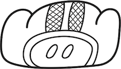

# Welcome to the Cenote Shoppe Shopping Cart App

By running this application using Node.js, you will be able to gather the gear you need to dive into the mysterious cenote as described in Part 2 of the [Azure Maya Mystery](https://aka.ms/AzureMayaMystery).

> This app is built with Node.js. To learn all about Node, please visit Microsoft Learn's Node.js [learning path](https://docs.microsoft.com/en-gb/learn/paths/build-javascript-applications-nodejs/?WT.mc_id=mayamystery-github-chnoring).

Start by installing all the app's dependencies

```bash
npm install
```

Run the shop by typing

```bash
node app.js
```

The app should be up and running on port `3000` on your localhost (http://localhost:3000).

Try adding items to the cart. If you can add the one item you need for this part of the game into your cart, the attached API will tell you what the code is to enable delivery of your gear AND reveal the name of the second glyph that makes up the mysterious temple's name. Make a note of the code and return to the Maya Mystery to input it into the correct space. Here's a hint of its meaning, via its Maya glyph:



-   Art by Dana Moot II

## Contributing

This project welcomes contributions and suggestions. Most contributions require you to agree to a
Contributor License Agreement (CLA) declaring that you have the right to, and actually do, grant us
the rights to use your contribution. For details, visit https://cla.opensource.microsoft.com.

When you submit a pull request, a CLA bot will automatically determine whether you need to provide
a CLA and decorate the PR appropriately (e.g., status check, comment). Simply follow the instructions
provided by the bot. You will only need to do this once across all repos using our CLA.

This project has adopted the [Microsoft Open Source Code of Conduct](https://opensource.microsoft.com/codeofconduct/).
For more information see the [Code of Conduct FAQ](https://opensource.microsoft.com/codeofconduct/faq/) or
contact [opencode@microsoft.com](mailto:opencode@microsoft.com) with any additional questions or comments.

## Legal Notices

Microsoft and any contributors grant you a license to the Microsoft documentation and other content
in this repository under the [Creative Commons Attribution 4.0 International Public License](https://creativecommons.org/licenses/by/4.0/legalcode),
see the [LICENSE](LICENSE) file, and grant you a license to any code in the repository under the [MIT License](https://opensource.org/licenses/MIT), see the
[LICENSE-CODE](LICENSE-CODE) file.

Microsoft, Windows, Microsoft Azure and/or other Microsoft products and services referenced in the documentation
may be either trademarks or registered trademarks of Microsoft in the United States and/or other countries.
The licenses for this project do not grant you rights to use any Microsoft names, logos, or trademarks.
Microsoft's general trademark guidelines can be found at http://go.microsoft.com/fwlink/?LinkID=254653.

Privacy information can be found at https://privacy.microsoft.com/en-us/

Microsoft and any contributors reserve all other rights, whether under their respective copyrights, patents,
or trademarks, whether by implication, estoppel or otherwise.
